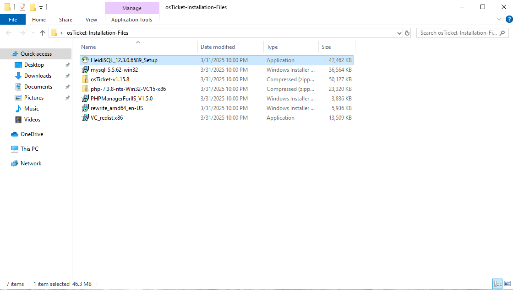
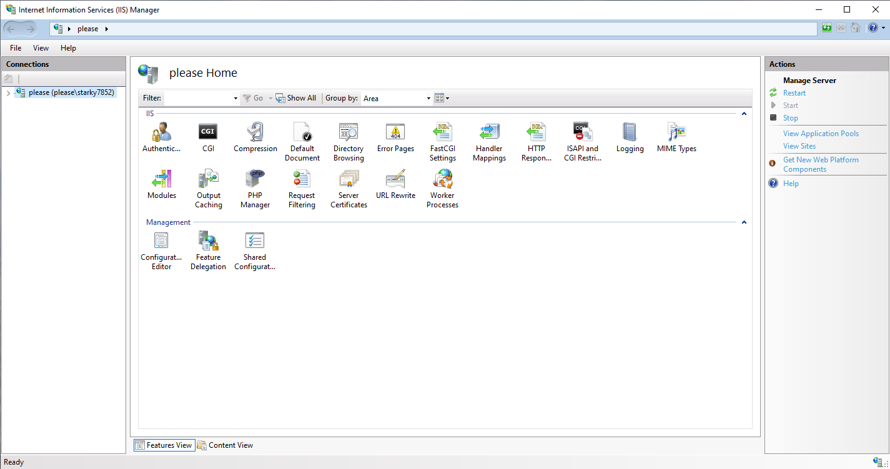
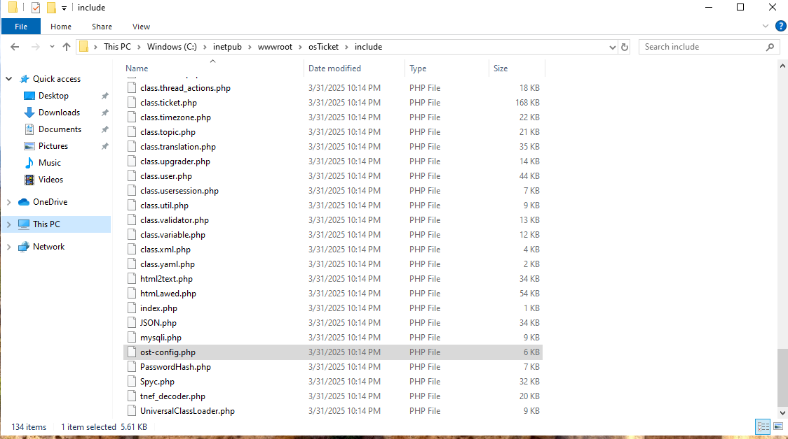

# osticket-prereqs

<h1>osTicket - Prerequisites and Installation</h1>
This tutorial outlines the prerequisites and installation of the open-source help desk ticketing system osTicket. 

<h2>Environments and Technologies Used</h2>

- Microsoft Azure (Virtual Machines/Compute)
- Remote Desktop
- Internet Information Services (IIS)

<h2>Operating Systems Used </h2>

- Windows 10</b> (21H2)

<h2>List of Prerequisites</h2>

- an Apache or iis web server
- PHP
- MySQL with full dedicated user priviledges

<h2>Installation Steps</h2>

download the basic instalation packet

 

go into the control panel, turn on windows features, activate cgi

 

install php manager, rewrite module, vc redist, and mysql. then once in the php manager enable to php extensions imap,intl,opache

 

copy the upload folder into inetpub\root and rename to osTicket

 

rename from sample config to just config

 

modify permissions 

 

create session within mysql

 

account creation on osticket website

 

 
